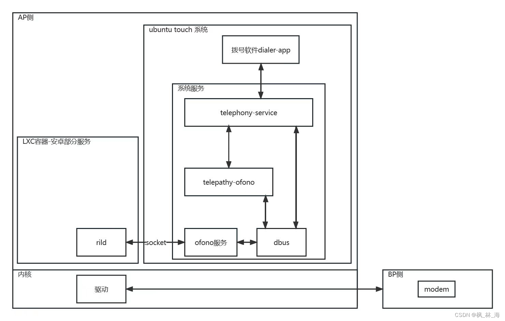
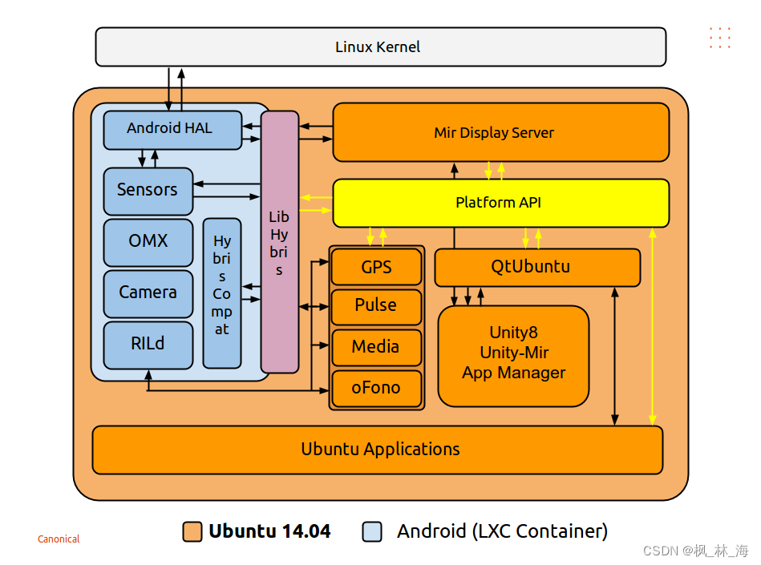

### 学习ofono过程中整理
1. 使用基于halium-7.1的适配，系统版本ubuntu touch 16.04
2. 对比安卓7的电话系统分析
3. 在ubuntu touch 中很多硬件都依赖于安卓的现成的驱动，由于安卓的很多硬件驱动都需要应用层服务配合，所以在系统中用LXC容器跑了部分必要的安卓服务。
4. 对于电话系统，使用ofono的rilmodem通过socket直连了安卓的rild服务。
5. 实际使用是安卓原有的相关驱动和libril厂商定制库。

#### 电话系统框架

#### ubuntu touch 系统整体框架（取自ubuntu官方）

